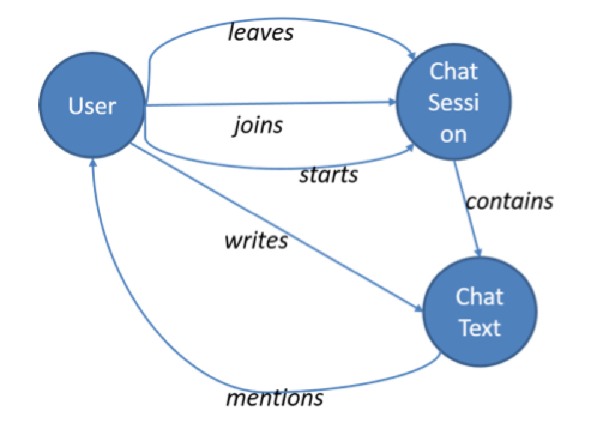
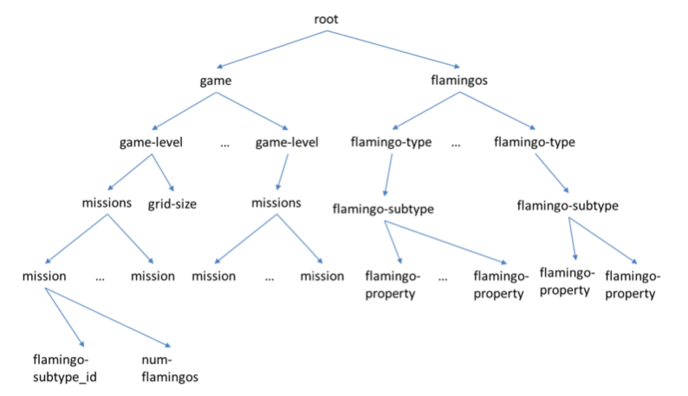

We will need a table to keep track of user clicks. Below is a rough structure of the table, but it is incomplete in the following ways:

1) There are no primary keys,
2) More columns may need to be added,
3) The data types are not all specified.

Copy the table below, paste it into your response, and complete the missing parts of the schema according to the list above. You may provide a brief explanation as needed.

```
userID: long	sessionID: __________	timestamp: dateTime	clickedPoint: coordinate	missionID: _________	isHit: _________	_________: _________
100	4356	10/12/2015::14:15:09	(4,8)	13	yes	_________
101	3241	10/23/2015::14:15:19	(20,5)	18	no	_________
102	4537	11/4/2015::14:15:20	(17,43)	21	no	_________
```
```
userID: long(PK)	sessionID: long(PK)	timestamp: dateTime	clickedPoint: coordinate	missionID: int(FK)	isHit: ENUM/string	Score: (int)
100	4356	10/12/2015::14:15:09	(4,8)	13	yes	10
101	3241	10/23/2015::14:15:19	(20,5)	18	no	0
102	4537	11/4/2015::14:15:20	(17,43)	21	no	0
```

1) Primary keys are userID and sessionID. There are another foreign key, missionID that point on the mission table.
2) Maybe Score (int) column should be added.
3) sessionID is long, because it grows very fast. MissionID int should be enough because there are limited missions. For isHit there are two options: ENUM with yes or no allowed input or simply string.

Next, we will look at the chat data. We know users can chat when they discuss their team’s strategy or when they decide if a new player should join a team. This can be modeled as a graph, as shown below.



The nodes of the graph are entities and the edges are actions they take and the content of the chat. When this graph is populated, we need to include a number of properties to the nodes and edges (recall the lecture covering the property graph model). For example, each action edge should have a timestamp attribute to indicate when the action occurred. Using this graph, we should be able to analyze different types of questions.

**List all node and edge properties for a graph.**

**Briefly explain how you would use the graph to answer the following five questions?**

1. Which teams are having more conversations?
2. Do users chat more (or less) before they leave a team?
3. What are the dominant terms (words) used in a chat session within a specific time period?
4. Which users are most active in a specific chat session?
5. How many chat sessions is a user participating in at the same time?

```
ID    Propertu(Node)
1     User
2     Session
3     Text
```

```
srcID descID Property(Edge)
1     2      Joins
1     2      Leaves
1     2      Starts
2     3      Contains
1     3      Writes
3     1      Mention
```

1. find communities of users (teams) and count the number of sessions.
2. Group text messages based on users and two groups: based on edge type "leaves" and "join"+"starts"
3. create a document vector model and compute TF-IDF foreach text message sended within a specific time period.
4. Group nodes with edge type "write" by userID and sessionID  and count them. 
5. Group nodes with edge types "joins" or "starts" by userID and count them. 

We will need to design the structure of the game itself. We will use the following partially specified semistructured data object.



We have seen that both XML and JSON are essentially trees. The tree here says that the “missions” category can have several “mission” items. Each mission item will have an associated flamingo type (e.g., flamingos with stars on their backs) and the number of flamingos of that type released to the users to catch. We also have flamingos of different types and subtypes, where each subtype will have a list of properties.

**Explain how you might extend the tree with at least five specific flamingo properties. For example, beak-color whose values might be “bright-red” or “pink”.**

**Your objective is to make sure the tree has enough properties to launch the game and connect with the three data structures we have used so far.**

I should extend the flamingo properties because the game grows over time. New flamingos will be released in the future for free or paid and it should be enough difference and properties between each flamingo. This is useful for user engagement over time and user ranking.

Flamingo Properties:

- flamingoName (string) ex. "Real Flaming"
- beakColor (string) ex. pink, red, black...
- plumeColor (string) ex. pink, red, black...
- legsColor (string) ex. pink, yellow, white
- dim (tuples of int, one for X and one for Y)
- catchingFoods (list of string) 
- life (int, the number of hits for catch)
- scoreHit (int) ex. from 1 to 10 or 20. 