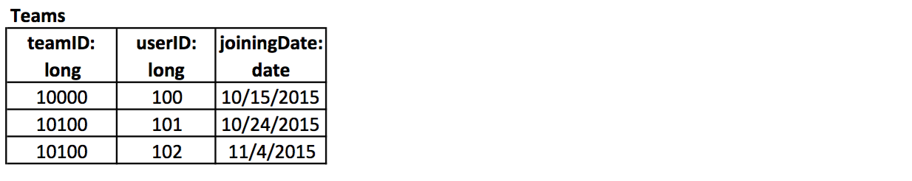

# Peer-graded Assignment: Designing a Data Model for 'Catch the Pink Flamingo'

The goal of this assignment is to design the data structures required for creating the game. Remember, that there are three aspects of the game:

1) Designing the data required to run the game

2) Keeping track of what is going on when people are actually playing the game, and

3) Analyzing how people played past games so that we can improve the way the game is played

With this in mind, let us list what we would need.

First, the game will have **users**, i.e., the players and we need to know some details about them. This information will typically be a relational table that may look like this.

Users ( userID:longInteger, userName:string, joiningDate:date, dateOfBirth:date, currentLevel:int, authenticationKey:string )

Diagrammatically, this would look like:

where **userID** is underlined because it is a primary key for this relation.

We also know that users would form **teams**. However, these teams would possibly grow and shrink with time. But it is reasonable to assume that one user will be a part of only one team at any time, and unless we know that the user joined another team more recently, the user belongs to the team she joined last. We can also model teams as relations, which might look like this:

With this table we should be able to determine the members of a team at any point in time, and track how a user has changed teams over time. Remember that a level 1 user will not appear in this table.

For this assignment, we will present incomplete specifications for a few data structures and your task will be to complete them.