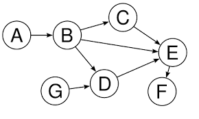
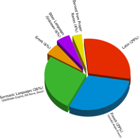
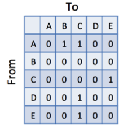
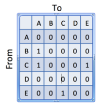

# Quiz 1 - Introduction to Graphs

### 1. Which of the following are graphs? (check all that apply)

-  [X]
- 

#### 2. Which of the following is the correct adjacency matrix for this graph?

 

-  [X]
- 
- Neither option is correct.

#### 3. Which of the following content would be objects (or nodes) in a graph that represents the activity in a facebook page?

- Created_post (the action of creating a post)
- **post text**
- **comment text**
- **location**
- friends (the action of making someone your friend)

### 4. Based on the videos, which kinds of analysis might one be able to perform on a tweet graph?

- **find interacting groups of users**
- **extract conversation threads**
- **find influencers in a twitter community**

### 5. The key reason mentioned in the video that biology applications need Big Data analytics is...

- **The integration of multiple data sources from different researchers and of different sources of information.**
- The complexity of interactions that correlate to inform phenotypes.
- The new use of computational techniques to explore new areas of biology research more quickly than can be done with "live" or wetlab experiments.

### 6. Which of the Vs BEST describes the result in constant increasing in the number of edges in a graph, sometimes causing challenges in knowing when one has found "an answer" to one's analysis question?

- Variety
- Volume
- **Velocity**
- Valence

### 7. Which of the Vs results in increased algorithmic complexity (which can cause analyses to not be able to finish running in reasonable amounts of time)?

- Valence
- Velocity
- **Volume**
- Variety

### 8. Which of the Vs results in challenges due to graphs created from varying kinds, formats, sources, and meanings of data?

- **Variety**
- Valence
- Volume
- Velocity

### 9. Which of the Vs causes increased interconnectivity of a graph -- which can cause problems in analysis due to density?

- Velocity
- Variety
- Volume
- **Valence**

### 10. Updating a graph with a stream of posting information on facebook is an example of which of the Vs?

- **Velocity**
- Volume
- Variety
- Valence

### 11. Studying Amarnath's gmail interactions over time (as gmail started to be used by more and more people) is BEST defined as an impact of which of the Vs?

- **Valence**
- Velocity
- Variety
- Volume
